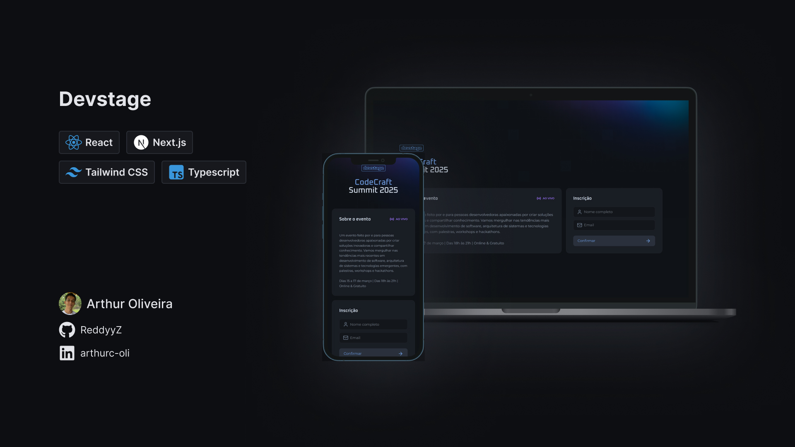

# 🚀 Devstage



## 📌 Sobre o Projeto

O **Devstage** é um sistema de indicações desenvolvido durante o evento **NLW Connect** na trilha **React**. O projeto teve como objetivo aprimorar minhas habilidades nas **principais tecnologias front-end** requisitadas no mercado.

## 🛠️ Tecnologias Utilizadas

O projeto foi desenvolvido utilizando as seguintes tecnologias:

- ⚛ **[React](https://react.dev/)** — Biblioteca para construção de interfaces modernas e dinâmicas.
- ⚡ **[Next.js](https://nextjs.org/)** — Framework React para SSR, SSG e melhor performance.
- 🎨 **[Tailwind CSS](https://tailwindcss.com/)** — Framework CSS utilitário para estilização rápida e responsiva.
- 📝 **[TypeScript](https://www.typescriptlang.org/)** — Superconjunto do JavaScript para código mais seguro e escalável.

## 🚀 Como Executar o Projeto

### ⚡ Executando o backend

1. **Clone o repositório do backend:**
   ```bash
   git clone https://github.com/rocketseat-education/nlw-connect-node.git && cd nlw-connect-node
   ```
2. **Instale as dependências:**
   ```bash
   npm install
   # ou
   yarn install
   # ou
   pnpm install
   ```
3. **Inicie os containers com Docker Composer:**
   ```bash
   docker composer up -d
   ```
4. **Faça as migrações do banco de dados:**
   ```bash
   npm run db:migrate
   ```
5. **Inicie o backend:**
   ```bash
   npm run dev
   ```
6. O backend estará rodando em `http://localhost:3333/`.

### ⚡ Executando o frontend

1. **Clone este repositório:**
   ```bash
   git clone https://github.com/ReddyyZ/devstage.git && cd devstage
   ```
2. **Instale as dependências:**
   ```bash
   npm install
   # ou
   yarn install
   # ou
   pnpm install
   ```
3. **Inicie o servidor de desenvolvimento:**
   ```bash
   npm run dev
   # ou
   yarn dev
   # ou
   pnpm dev
   ```
4. O projeto estará rodando em `http://localhost:3000/`.

## 🏗️ Estrutura do Projeto

Os principais arquivos do código estão organizados da seguinte forma:

```
/devstage
 ├── /public            # Arquivos estáticos
 ├── /src
 │   ├── /app           # Páginas da aplicação
 │   ├── /assets        # Imagens
 │   ├── /components    # Componentes reutilizáveis
 │   ├── /http          # Cliente HTTP para consultar a API
 ├── .prettierrc        # Configuração do Prettier
 ├── orval.config.ts    # Configuração do Orval para integração com API
 ├── postcss.config.mjs # Configuração do PostCSS
 ├── package.json       # Dependências do projeto
 ├── tailwind.config.js # Configuração do Tailwind CSS
 └── README.md          # Documentação do projeto
```

## 📩 Contato

Sou um desenvolvedor full-stack apaixonado por tecnologia e construção de soluções escaláveis. Busco aprimorar minhas habilidades constantemente e estou aberto a oportunidades.

📧 **E-mail:** [arthur.reddyyz.contact@gmail.com](mailto:arthur.reddyyz.contact@gmail.com)

### 🌎 Onde me encontrar:

<table>
  <tr>
    <td>
      <a href="https://www.linkedin.com/in/arthurc-oli">
        
      </a>
    </td>
    <td>
      <a href="https://github.com/ReddyyZ">
        
      </a>
    </td>
    <td>
      <a href="https://reddyyz.github.io/portfolio">
        
      </a>
    </td>
  </tr>
</table>

---

Feito com ❤️ por **Arthur Oliveira** 🚀.
